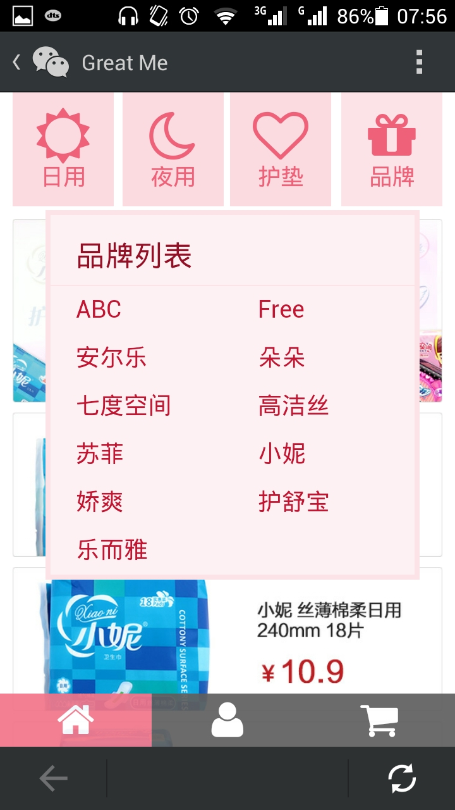
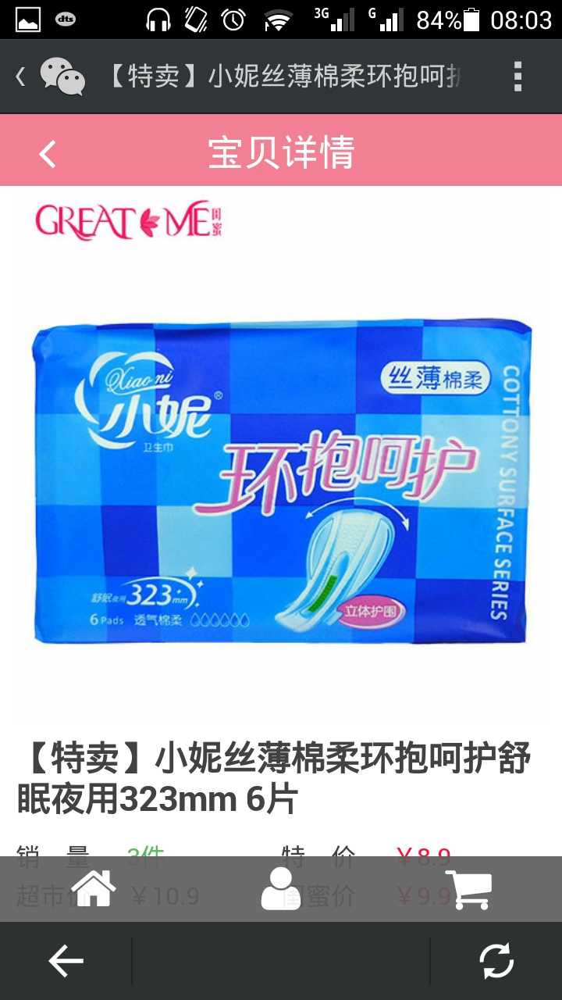
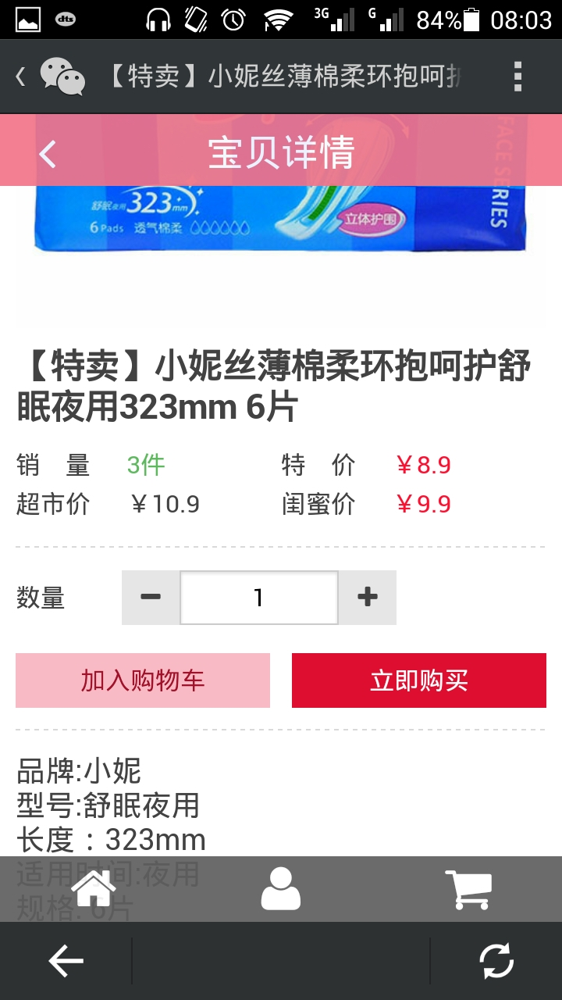
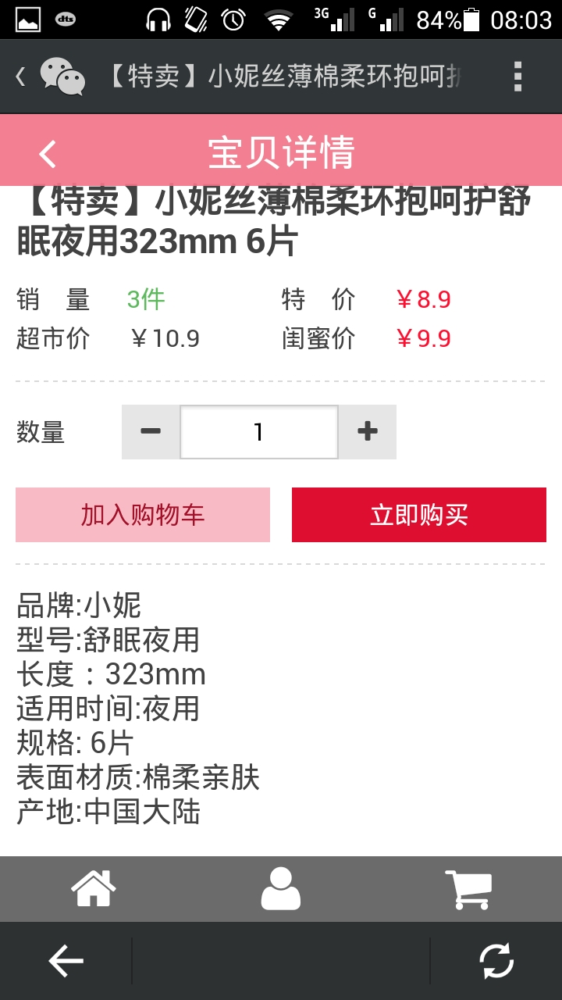
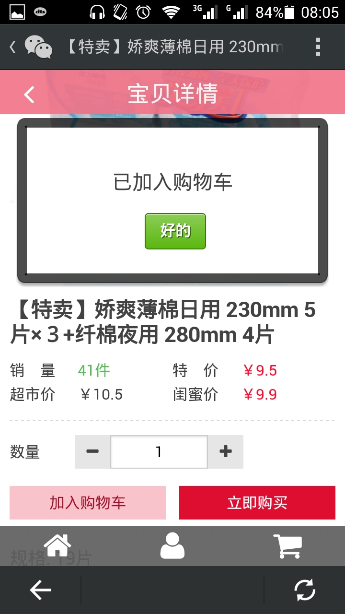
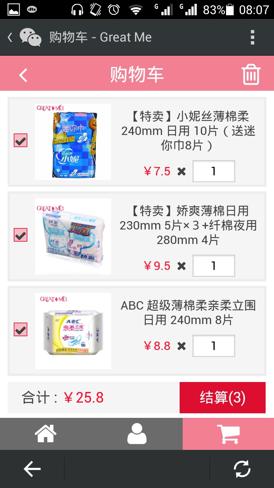
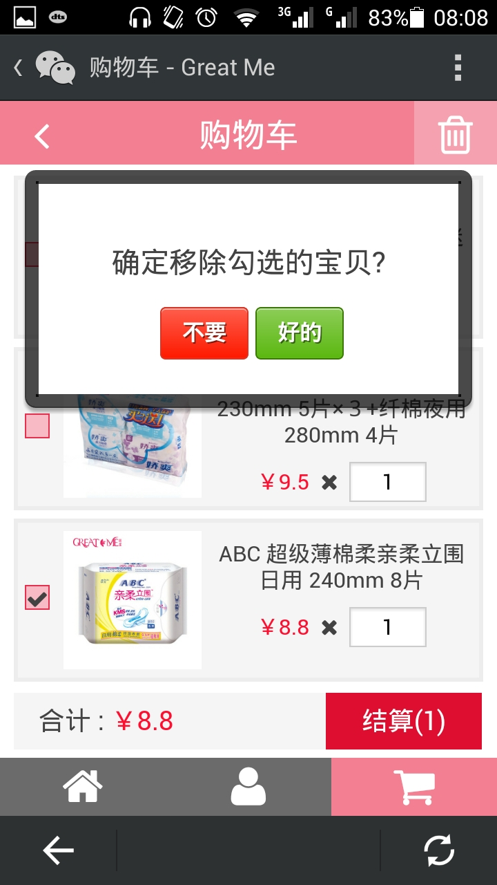
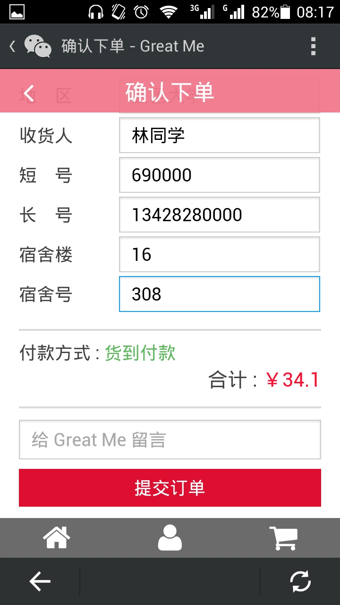
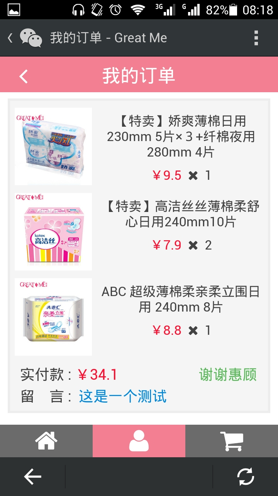

# mshop

An online shop adapted to mobile.

## Features

- Also as a Real Product: [Great Me](http://greatme.org) (Much Better on Mobile)
- PureCSS like Web Designing
- JS-Driven Static Data-Reading
- Highly Built with Grunt
- Completely Switched to Jade/JST

## Screenshots

 |  |  | 
--- | --- | --- | ---
 |  |  | 
 |  |  | 
 |  |  | 

More from [screenshots/](screenshots/)

## TODO

- Style Config
- Message Config
- Grunt Watch
- YUI Docs
- PhantomJS Test?
- Switch to AMD/CMD?

## License

MIT
